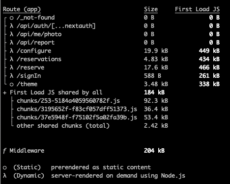

# training-workshop-performance

# Performance Afternoon

Performance is about retaining users.

* As an example, the BBC found they lost an additional 10% of users for every additional second their site took to load
* How Renault improved its bounce and conversion rates by measuring and optimizing Largest Contentful Paint
* How The Economic Times passed Core Web Vitals thresholds and achieved an overall 43% better bounce rate


https://web.dev/learn/performance/why-speed-matters


* **Largest Contentful Paint (LCP)**: measures loading performance. To provide a good user experience, LCP must occur within 2.5 seconds of when the page first starts loading.

* **Interaction to Next Paint (INP)**: measures interactivity. To provide a good user experience, pages must have a INP of 200 milliseconds or less.

* **Cumulative Layout Shift (CLS)**: measures visual stability. To provide a good user experience, must should maintain a CLS of 0.1. or less.

https://web.dev/articles/vitals

## Tools

https://github.com/GoogleChrome/web-vitals

## JavaScript is slow, real or not?


## Why is my app slow?

- Slow network

- Large Images

- Large Bundle size

- To many data fetches
 
- To large data payloads

- Blob data over JSON

- No caching of assets

- No minimize and/or compression of payloads

- Fetch Waterfall


- Slow API Calls

  - Slow DB queries

  - To much data

  - Slow (or underpowered) server

- To much javascript

## Investigate

- Your browser dev tools are your friend
  - Network tab 😀
  - Performance tab 🫣
  
  - [Lighthouse](https://developers.google.com/web/tools/lighthouse) is your friend 😀


- 3th party performance testers
  - [PageSpeed Insights](https://developers.google.com/speed/pagespeed/insights/)

  - [WebPageTest](https://www.webpagetest.org/)

  - [Builder.io - Performance Insights](https://www.builder.io/c/performance-insights)

> Test Case: 
>   https://wwc.resengo.com/
>   https://www.fedex.com/
>   https://www.euricom.com/

## Solutions

- Slow network
  - Its up to the user, but we must optimize for it
  
- Large Images
  - Optimize images, resize images, better image formats

  - SrcSet
  - Use modern image formats (webp)
  - Optimize images
    - https://imagecompressor.com/
    - https://squoosh.app/
    - https://tinypng.com/
    - [imagemin-cli](https://github.com/imagemin/imagemin-cli)
  
  - Look out for bin blob inside svg's
  - svg < 20kb, png < 50kb
  - Stale-While-Revalidate in the browser (SWR, TanStack Query, NextJS, http headers)

- No caching of assets
  - Cached your assets (http headers)
  - https://simonhearne.com/2022/caching-header-best-practices/

```
// Index.html
Cache-Control: no-store, no-cache, must-revalidate

// Images
Cache-Control "public max-age=864000

// Fonts
Cache-Control "public, max-age=31536000

// JS/CSS
Cache-Control "public, max-age=31536000, immutable
```

- No minimize and/or compression of payloads

  - GZip or Brotli
  - Minimize your assets (html, css, js)

- Large Bundle size
  - Analyze your bundle size

  - Remove large dependencies

  - Make sure you or the bundler is tree shaking

  - Split bundles (lazy loading)

- To large data payloads
  - Do we need all that data?

  - Are blobs the right choice?

  - Fetch images/pdf via separate request and let browser handle the cache.

- To many data fetches
  - Consolidate data fetches (graphql)

  - BFF (Backend for Frontend)

  - Cache data (Stale-While-Revalidate)

  - Use `SWR` or `TanStack Query` to cache data
  
- Fetch Waterfall
  - Investigate why you have a fetch waterfall

  - Use `Promise.all` or `async await` to fetch data in parallel

- To much javascript
  - Do we need all those libraries?
    - MomentJS
    - Lodash (the wrong way, no three shaking)
    - libphonenumber-js

  - [Bundlefobia](https://bundlephobia.com/) is your friend
  
- Slow API Calls
  - FE Developer -> fix your backend 🙄

- Slow DB queries
  - Add indexes

  - Be aware of the 1 + n problem

  - Aggregate data in the DB (document DB)

- Slow API Calls
  - Use Promise.All in favor of async wait

  - Use streaming in favor of loading in memory

  - Use async in favor of sync functions (reading files) 
  
  - Add caching (redis)

- To much data 
  - Add paging (Think about it during your design!)

- Slow (or underpowered) server
  - Scale vertically of horizontally

  - You can also scale your DB server

  - Serverless can have a slow cold start

  - To much javascript
    - Split bundles & lazy load
    - Remove/replace large libraries
    - Offload processing/rendering to the server (nextjs, nuxt)
    - Use server first framework (Astro)

- General

  - [get-the-best-performance-on-your-next-js-app](https://javascript.plainenglish.io/get-the-best-performance-on-your-next-js-app-f407cc25d1f9)


## Analyzing

- Bundle Analyzers

  * [webpack-bundle-analyzer](https://www.npmjs.com/package/webpack-bundle-analyzer)
  * [vite-bundle-visualizer](https://www.npmjs.com/package/vite-bundle-visualizer)
  * [@next/webpackBundleAnalyzer](https://www.npmjs.com/package/@next/bundle-analyzer)
  * [@next/webpackBundleAnalyzer](https://www.npmjs.com/package/@next/bundle-analyzer)

- You build dump can help you

### Euricom Desk Reservation



### Euricom Performance Cycle


### Test App build


## Appendix

- https://medium.com/java-performance/performance-is-the-enemy-of-clean-code-fdd65c4c7d99
- [React 19](https://daily.dev/blog/react-19-everything-you-need-to-know-in-one-place) 
- [Million.dev](https://www.youtube.com/watch?v=VkezQMb1DHw&t=166s)

### .NET vs Express vs Fastify vs Hono vs Rust

- https://medium.com/deno-the-complete-reference/net-vs-java-vs-go-vs-rust-hello-uuid-performance-7ead3e7e79aa
- https://medium.com/deno-the-complete-reference/net-vs-node-js-frameworks-hello-uuid-performance-c970a5d8548a
- https://medium.com/deno-the-complete-reference/deno-express-vs-fastify-vs-oak-vs-hono-whos-runs-fastest-0657d791c17a#:~:text=In%20performance%20testing%2C%20Express%20emerged,spectrum%20of%20Express%20and%20Hono.

## Let work together

1. Analyze & improve the performance of the demo app
2. Investigate other projects (maybe yours) and see what we can improve.
3. Create POC with https://million.dev/
4. Add cache headers to the demo app and improve the performance. Check out that [stale-while-revalidate](https://web.dev/articles/stale-while-revalidate)
5. Add REDIS cache to the demo app and improve the performance
6. Discuss other performance issues and improvements
