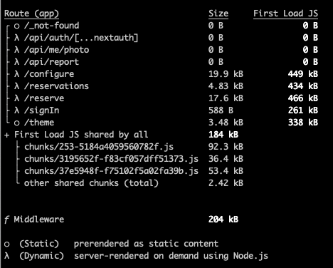

# Performance Afternoon

https://web.dev/learn/performance/why-speed-matters

### Why it is slow

- Slow network
- Large Images
- Large Bundle size
- To many data fetches
- Fetch Waterfall
- Slow API Calls
  - Slow DB queries
  - To much data (add paging)
    - Think about it during your design!
  - Slow (or underpowered) server

[Lighthouse](https://developers.google.com/web/tools/lighthouse) is your friend 😀


### Samples

- https://wwc.resengo.com/

### Measure performance

**Bundle Size**

Analyzers

* [webpack-bundle-analyzer](https://www.npmjs.com/package/webpack-bundle-analyzer)
* [vite-bundle-visualizer](https://www.npmjs.com/package/vite-bundle-visualizer)
* [@next/webpackBundleAnalyzer](https://www.npmjs.com/package/@next/bundle-analyzer)
* [@next/webpackBundleAnalyzer](https://www.npmjs.com/package/@next/bundle-analyzer)

Builds




**App performance**

* [Lighthouse](https://developers.google.com/web/tools/lighthouse)
* [PageSpeed Insights](https://developers.google.com/speed/pagespeed/insights/)
* [WebPageTest](https://www.webpagetest.org/)


### Improve performance

#### API Services

- Add DB indexes
- Add paging
- Add DB caching (redis)
- Stale-While-Revalidate (NextJS

#### Client (browser)

- Split bundles
  
  - Router level

```tsx
const Home = lazy(() => import('./home'));
const About = lazy(() => import('./about'));

function App() {
  return (
    <Router>
      <Suspense fallback={<p> Loading...</p>}>
        <Routes>
          <Route path='/' element={<Home />} />
          <Route path='/about' element={<About />} />
        </Routes>
      </Suspense>
    </Router>
  );
}
```

  - NextJS & Remix
  

- Cached your assets
  - Index.html: 
    - Cache-Control: no-store, no-cache, must-revalidate
  - Images: 
    - Cache-Control "public max-age=864000"
  - Fonts: 
    - Cache-Control "public, max-age=31536000"
  - JS/CSS: 
    - Cache-Control "public, max-age=31536000, immutable"
  - Cache-Control with stale-while-revalidate headers

- Optimize images
  - Use modern image formats (webp)
  - https://imagecompressor.com/
  - https://squoosh.app/
  - https://tinypng.com/
  - [imagemin-cli](https://github.com/imagemin/imagemin-cli)
  - Look out for bin blob inside svg's
  - svg < 20kb, png < 50kb

- Stale-While-Revalidate in the browser (SWR, TanStack Query, NextJS)

- Make sure your data transfer is Gziped (or Brotli)


- https://github.com/GoogleChrome/web-vitals
- https://web.dev/articles/vitals
- https://simonhearne.com/2022/caching-header-best-practices/


- https://medium.com/java-performance/performance-is-the-enemy-of-clean-code-fdd65c4c7d99
- https://javascript.plainenglish.io/get-the-best-performance-on-your-next-js-app-f407cc25d1f9
- https://million.dev/
- https://daily.dev/blog/react-19-everything-you-need-to-know-in-one-place
- https://www.youtube.com/watch?v=VkezQMb1DHw&t=166s
- 